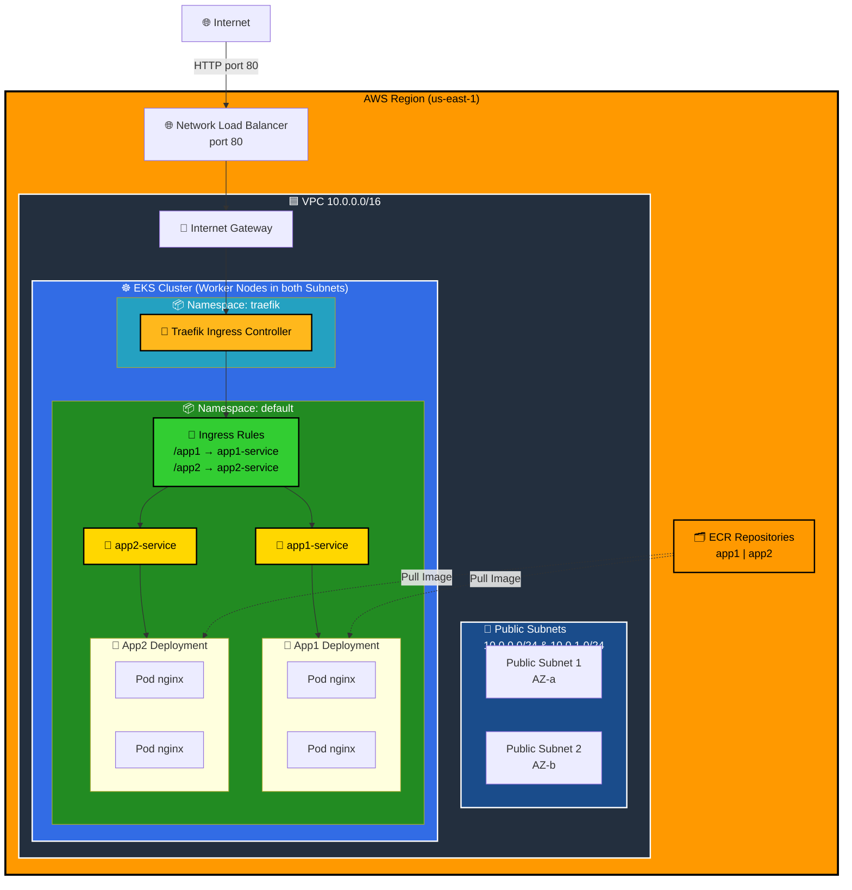
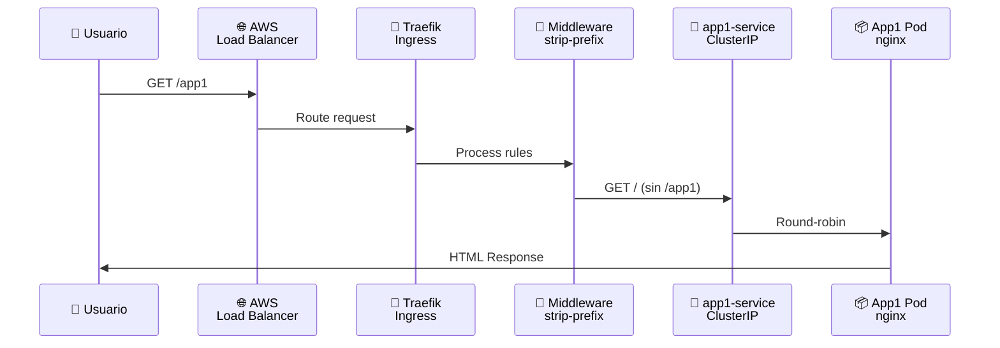

# 🚀 EKS + Traefik + Docker + ECR Lab

> **Laboratorio completo para desplegar aplicaciones Docker en AWS EKS con exposición mediante Traefik Ingress Controller**

<div align="center">


[](https://aws.amazon.com)
[](https://kubernetes.io)
[](https://www.docker.com)
[](https://www.terraform.io)


**[Descripción](#📋-descripción) • [Características](#✨-características) • [Arquitectura](#🏗️-arquitectura) • [Inicio Rápido](#🚀-inicio-rápido) • [Estructura](#📁-estructura-del-proyecto) • [Documentación](#📚-documentación-completa)**

### Tecnologías Principales

[](https://nginx.org)
[](https://html.spec.whatwg.org)
[](https://www.w3.org/Style/CSS)
[](https://kubernetes.io)
[](https://www.docker.com)
[](https://www.terraform.io)
[](https://traefik.io)
[](https://aws.amazon.com)
[](https://helm.sh)
[](https://docs.microsoft.com/en-us/windows-server/administration/windows-commands/windows-commands-ref)

</div>

---

## 📋 Descripción

Este laboratorio es un **flujo completo de DevOps** que demuestra cómo construir, versionar y desplegar aplicaciones containerizadas en Kubernetes usando AWS EKS y Traefik como Ingress Controller. 

---

## ✨ Características Principales

| Característica | Descripción |
|---|---|
| 🐳 **Docker** | Imágenes personalizadas basadas en nginx:alpine |
| 🗂️ **ECR** | 2 repositorios privados en AWS para almacenar imágenes |
| ☸️ **EKS** | Cluster Kubernetes completamente managed |
| 🔀 **Traefik** | Ingress Controller con 1 solo Load Balancer |
| 🌐 **Multi-ruta** | 2 aplicaciones en `/app1` y `/app2` |
| 🔧 **IaC** | Todo definido en Terraform (reproducible y versionable) |
| ⚡ **Alta Disponibilidad** | 2 replicas por app en 2 nodos diferentes |
| 📊 **Monitoreo** | Fácil integración con CloudWatch y Prometheus |

---

## 🏗️ Arquitectura

### Diagrama General



### Flujo de Tráfico (Request)



### Stack Tecnológico

| Capa | Tecnología | Propósito |
|------|-----------|----------|
| **Infraestructura** |  | IaC para AWS |
| **Cloud Provider** |  | Servicios managed |
| **Orquestación** |  | Gestión de contenedores |
| **Ingress Controller** |  | Enrutamiento HTTP(S) |
| **Containerización** |  | Empaquetado de apps |
| **Container Registry** |  | Almacenamiento privado |
| **Provisioning** |  | Declarativo & reproducible |
| **Automatización** |  | Scripts de build y deploy |

---

## 🚀 Inicio Rápido

### ✅ Requisitos Previos

```cmd
# Verificar instalaciones
terraform version      # >= 1.0
aws --version          # >= 2.0
kubectl version        # >= 1.20
docker --version       # >= 20.10
helm version           # >= 3.0
```

**Instalaciones necesarias:**
- [Terraform](https://www.terraform.io/downloads)
- [AWS CLI](https://aws.amazon.com/cli/)
- [kubectl](https://kubernetes.io/docs/tasks/tools/)
- [Docker Desktop](https://www.docker.com/products/docker-desktop)
- [Helm](https://helm.sh/docs/intro/install/)

**Credenciales AWS:**
```cmd
aws configure
# Ingresa: Access Key ID, Secret Access Key, Region (us-east-1), Output format (json)
```

### 📦 Instalación de Dependencias

**En Windows (PowerShell como Admin):**
```powershell
# Instalar Terraform
choco install terraform

# Instalar AWS CLI
msiexec.exe /i https://awscli.amazonaws.com/AWSCLIV2.msi

# Instalar kubectl
choco install kubernetes-cli

# Instalar Docker Desktop
choco install docker-desktop

# Instalar Helm
choco install kubernetes-helm
```

### 🎬 Despliegue Paso a Paso

#### **Paso 1️⃣ - Crear Infraestructura AWS** (⏱️ 15-20 minutos)

```cmd
cd terraform
terraform init
terraform plan    # Revisar recursos a crear
terraform apply   # Crear VPC, EKS, ECR, NLB
```

**Recursos creados:**
- 1 VPC con 2 subnets públicas
- 1 Cluster EKS con Kubernetes 1.31
- 2 nodos EC2 t3.small
- 2 repositorios ECR
- 1 Internet Gateway

#### **Paso 2️⃣ - Configurar kubectl** (⏱️ 1 minuto)

```cmd
aws eks update-kubeconfig --region us-east-1 --name eks-traefik-lab
kubectl get nodes           # Verificar 2 nodos conectados
kubectl get namespaces      # Verificar namespaces
```

#### **Paso 3️⃣ - Construir y Subir Imágenes a ECR** (⏱️ 2-5 minutos)

```cmd
cd scripts
build-and-push.bat
```

**Qué hace:**
- Construye imágenes Docker de app1 y app2
- Autentica con ECR usando AWS CLI
- Sube imágenes a los repositorios ECR
- Etiqueta como `latest`

#### **Paso 4️⃣ - Actualizar Manifiestos Kubernetes** (⏱️ 1 minuto)

```cmd
update-manifests.bat
```

**Qué hace:**
- Obtiene las URLs de ECR desde Terraform
- Actualiza `app1.yaml` y `app2.yaml` con imágenes correctas
- Reemplaza placeholders con URLs reales

#### **Paso 5️⃣ - Instalar Traefik Ingress Controller** (⏱️ 2-3 minutos)

```cmd
install-traefik.bat
```

**Qué instala:**
- Helm chart de Traefik 3.x
- Crea namespace `traefik`
- Configura service LoadBalancer
- Habilita Traefik CRDs

#### **Paso 6️⃣ - Desplegar Aplicaciones** (⏱️ 3-5 minutos)

```cmd
cd ..\kubernetes
kubectl apply -f app1.yaml
kubectl apply -f app2.yaml
kubectl apply -f ingress.yaml

# Verificar deployments
kubectl get deployments
kubectl get pods
```

#### **Paso 7️⃣ - Obtener URL del Load Balancer** (⏱️ 1-5 minutos)

```cmd
kubectl get svc traefik -n traefik -w

# Esperar a que EXTERNAL-IP aparezca (puede tardar 3-5 minutos)
```

**Resultado esperado:**
```
NAME      TYPE           CLUSTER-IP      EXTERNAL-IP                                                           PORT(S)
traefik   LoadBalancer   10.100.200.100  a1234567890abcdef-1234567890.us-east-1.elb.amazonaws.com   80:30123/TCP
```

#### **Paso 8️⃣ - Acceder a las Aplicaciones**

```cmd
# Reemplazar con tu EXTERNAL-IP
http://a1234567890abcdef-1234567890.us-east-1.elb.amazonaws.com/app1
http://a1234567890abcdef-1234567890.us-east-1.elb.amazonaws.com/app2
```

---

## 📁 Estructura del Proyecto

```
eks-traefik/
│
├── 📄 README.md                           ← Estás aquí
├── 📄 PROJECT-STRUCTURE.md                # Detalles de estructura
├── 📄 COMMANDS.md                         # Todos los comandos
│
├── 📂 apps/                               # Código de aplicaciones Docker
│   ├── 📄 README.md
│   ├── 📂 app1/
│   │   ├── Dockerfile                     # Base: nginx:alpine
│   │   └── index.html                     # Página morada (tema)
│   └── 📂 app2/
│       ├── Dockerfile                     # Base: nginx:alpine
│       └── index.html                     # Página rosa (tema)
│
├── 📂 terraform/                          # Infraestructura como Código (IaC)
│   ├── provider.tf                        # Configuración AWS (v5.0+)
│   ├── variables.tf                       # Variables (region, cluster name, etc)
│   ├── vpc.tf                             # VPC + Subnets + IGW (10.0.0.0/16)
│   ├── eks.tf                             # Cluster EKS + Worker Nodes
│   ├── ecr.tf                             # 2 Repositorios privados de ECR
│   ├── outputs.tf                         # URLs y comandos útiles
│   ├── terraform.tfvars.example           # Plantilla de variables
│   └── terraform.tfstate(.backup)         # Estado actual (NO commitear)
│
├── 📂 scripts/                            # Automatización
│   ├── build-and-push.bat                 # Build + Push a ECR (Windows)
│   ├── build-and-push.sh                  # Build + Push a ECR (Linux/Mac)
│   ├── update-manifests.bat               # Actualiza YAMLs (Windows)
│   ├── update-manifests.sh                # Actualiza YAMLs (Linux/Mac)
│   ├── install-traefik.bat                # Instala Traefik (Windows)
│   ├── install-traefik.sh                 # Instala Traefik (Linux/Mac)
│   └── traefik-values.yaml                # Configuración Helm para Traefik
│
└── 📂 kubernetes/                         # Manifiestos de Kubernetes
    ├── app1.yaml                          # Deployment + Service (App1)
    ├── app2.yaml                          # Deployment + Service (App2)
    └── ingress.yaml                       # Ingress + Middleware (Traefik)
```

### 📝 Descripción de Archivos Clave

| Archivo | Propósito | Tipo |
|---------|----------|------|
| `terraform/eks.tf` | Define cluster EKS con 2 nodos t3.small | Terraform |
| `terraform/ecr.tf` | Crea 2 repos ECR para almacenar imágenes | Terraform |
| `apps/app1/Dockerfile` | Imagen Docker base nginx + HTML personalizado | Docker |
| `kubernetes/app1.yaml` | Deployment con 2 réplicas + ClusterIP Service | Kubernetes |
| `kubernetes/ingress.yaml` | Traefik Ingress con rutas /app1 y /app2 | Kubernetes |
| `scripts/build-and-push.bat` | Compila imágenes Docker y las sube a ECR | Bash/Batch |

---

## 🛠️ Tecnologías Utilizadas

### Frontend & Apps

| Tecnología | Versión | Propósito |
|-----------|---------|----------|
| [](https://nginx.org) | Alpine | Servidor web ligero |
| [](https://html.spec.whatwg.org) | 5 | Contenido de aplicaciones |
| [](https://www.w3.org/Style/CSS) | 3 | Estilos visuales |

### Infraestructura & DevOps

| Tecnología | Versión | Propósito |
|-----------|---------|----------|
| [](https://www.docker.com) | 20.10+ | Containerización |
| [](https://kubernetes.io) | 1.31 (EKS) | Orquestación de contenedores |
| [](https://aws.amazon.com) | - | Cloud provider |
| [](https://www.terraform.io) | 1.0+ | Infrastructure as Code |
| [](https://traefik.io) | 3.x | Ingress Controller |

### Servicios AWS Utilizados

```
├── VPC (Virtual Private Cloud)
│   ├── 2 Subnets públicas (10.0.0.0/24, 10.0.1.0/24)
│   ├── 1 Internet Gateway
│   └── Rutas públicas
├── EKS (Elastic Kubernetes Service)
│   ├── Cluster Kubernetes 1.31
│   └── 2 nodos EC2 t3.small
├── EC2 (Elastic Compute Cloud)
│   └── 2 instancias t3.small (workers)
├── ECR (Elastic Container Registry)
│   ├── eks-traefik-lab-app1
│   └── eks-traefik-lab-app2
├── ELB (Elastic Load Balancing)
│   └── Network Load Balancer (NLB)
└── IAM (Identity & Access Management)
    ├── Roles para EKS
    └── Roles para nodos
```

---

## 💰 Estimación de Costos

**Desglose mensual aproximado** (~$125/mes):

| Servicio | Cantidad | Costo/mes | Notas |
|----------|----------|-----------|-------|
| **EKS** | 1 cluster | $73 | Cuota fija de cluster |
| **EC2 (t3.small)** | 2 nodos × 730 hrs | $30 | ~$0.021/hora cada uno |
| **NLB** | 1 load balancer | $16 | Cuota fija (~$0.006/LCU/hr) |
| **Datos transferidos** | < 1 GB | $0.09 | Egress data transfer |
| **ECR** | 4 imágenes × 50MB | $0.01 | $0.10 por GB almacenado |
| **Almacenamiento EBS** | 40 GB | $3.40 | Para nodos (~$0.085/GB) |
| **TOTAL** | - | **~$122.50** | **Sin garantía de exactitud** |

**Formas de reducir costos:**
- Usar `t3.micro` en vez de `t3.small` (-$15/mes)
- 1 nodo en lugar de 2 (-$15/mes pero sin HA)
- Eliminar recursos cuando no uses el lab (-$122.50/mes)

---

## 📚 Documentación Completa

### Archivos adicionales en este repositorio

| Archivo | Contenido |
|---------|----------|
| **COMMANDS.md** | Todos los comandos detallados (build, deploy, destroy) |
| **PROJECT-STRUCTURE.md** | Explicación profunda de la estructura |
| **terraform/outputs.tf** | URLs y valores útiles después de terraform apply |
| **kubernetes/app1.yaml** | Deployment App1 con especificaciones de recursos |
| **kubernetes/app2.yaml** | Deployment App2 con especificaciones de recursos |

### 🎓 Concepto Clave: Arquitectura de 3 Capas

```
┌─────────────────────────────────────────┐
│  CAPA 1: CONTENEDORES (Docker)          │
│  - Imágenes Docker                      │
│  - Dockerfiles personalizados           │
│  - Base: nginx:alpine                   │
└─────────────────────────────────────────┘
              ↓
┌─────────────────────────────────────────┐
│  CAPA 2: ORQUESTACIÓN (Kubernetes)      │
│  - Deployments (replicas)               │
│  - Services (networking)                │
│  - Ingress (exposición)                 │
│  - Pods (instancias)                    │
└─────────────────────────────────────────┘
              ↓
┌─────────────────────────────────────────┐
│  CAPA 3: INFRAESTRUCTURA (AWS)          │
│  - EC2 (máquinas virtuales)             │
│  - VPC (red privada)                    │
│  - ELB (balanceo de carga)              │
│  - ECR (registro de imágenes)           │
└─────────────────────────────────────────┘
```

---

## 🔄 Flujo de Trabajo Típico

### Actualizar una Aplicación

```cmd
# 1. Modificar código HTML
code apps\app1\index.html

# 2. Construir y subir a ECR
cd scripts
build-and-push.bat

# 3. Actualizar manifiestos (si la imagen cambió)
update-manifests.bat

# 4. Aplicar cambios en Kubernetes
cd ..\kubernetes
kubectl apply -f app1.yaml

# 5. Forzar reinicio de pods (si la imagen tiene el mismo tag)
kubectl rollout restart deployment app1
```

### Ver Logs de una Aplicación

```cmd
# Ver logs del deployment
kubectl logs deployment/app1 --tail=50 -f

# Ver logs de un pod específico
kubectl logs pod/app1-xyz123 -f

# Ver eventos del cluster
kubectl describe pod app1-xyz123
```

### Debugging & Troubleshooting

```cmd
# ¿Es correcta la imagen en ECR?
aws ecr describe-images --repository-name eks-traefik-lab-app1 --region us-east-1

# ¿Está el pod running?
kubectl get pods -o wide

# ¿Puede Traefik llegar al servicio?
kubectl get svc app1-service
kubectl get endpoints app1-service

# ¿Está correctamente configurado el Ingress?
kubectl describe ingress apps-ingress
```

---

## 🧹 Limpieza & Destrucción

### ⚠️ IMPORTANTE: Orden de Eliminación

Sigue este orden para evitar costos extras y problemas:

```cmd
# 1️⃣ Eliminar aplicaciones
cd kubernetes
kubectl delete -f ingress.yaml
kubectl delete -f app2.yaml
kubectl delete -f app1.yaml

# 2️⃣ Desinstalar Traefik (incluye NLB)
helm uninstall traefik -n traefik
kubectl delete namespace traefik
# ⏱️ ESPERAR 3-5 MINUTOS para que AWS elimine el NLB

# 3️⃣ Destruir infraestructura AWS
cd ..\terraform
terraform destroy
# ⏱️ Confirmación requerida (escribe 'yes')
# ⏱️ Esperar 10-15 minutos
```

### Verificación Post-Destrucción

```cmd
# Verificar que todo fue eliminado
aws ec2 describe-instances --region us-east-1
aws ecr describe-repositories --region us-east-1
aws eks describe-clusters --region us-east-1
```

---

## 🎯 Lo que Aprendes

✅ **Docker**: Crear imágenes personalizadas y optimizadas  
✅ **AWS ECR**: Registry privado para containerización empresarial  
✅ **Kubernetes**: Orquestación, deployments, services, ingress  
✅ **Traefik**: Ingress controller moderno y flexible  
✅ **Terraform**: IaC para reproducibilidad y control de versiones  
✅ **DevOps**: Automatización de build, push, deploy  
✅ **Networking**: VPC, subnets, load balancing, DNS  
✅ **High Availability**: Múltiples replicas en múltiples nodos  

---

## 🐛 Troubleshooting Común

### El Load Balancer tarda mucho en aparecer
```bash
# Normal: 3-5 minutos
# Verificar progreso
kubectl get svc traefik -n traefik -w
```

### Error: "imagePullBackOff" en los pods
```bash
# Las imágenes no subieron correctamente a ECR
# Solución: volver a ejecutar scripts de build-and-push
./build-and-push.sh
./update-manifests.sh
kubectl apply -f app1.yaml
```

### Traefik instalado pero Ingress no funciona
```bash
# Verificar Ingress
kubectl describe ingress apps-ingress

# Verificar Traefik está leyendo rutas
kubectl logs -n traefik -l app=traefik --tail=50
```

### Error de credenciales AWS
```bash
# Reconfigurar AWS CLI
aws configure
aws sts get-caller-identity  # Verificar credenciales
```

---

## 📖 Recursos Externos

### Documentación Oficial

- 📖 [Kubernetes Documentation](https://kubernetes.io/docs/)
- 📖 [Traefik Documentation](https://doc.traefik.io/)
- 📖 [Terraform AWS Provider](https://registry.terraform.io/providers/hashicorp/aws/latest/docs)
- 📖 [AWS EKS User Guide](https://docs.aws.amazon.com/eks/latest/userguide/)
- 📖 [Docker Documentation](https://docs.docker.com/)

### Tutoriales & Guías

- 🎥 [Kubernetes Basics](https://kubernetes.io/docs/tutorials/kubernetes-basics/)
- 🎥 [Traefik Getting Started](https://doc.traefik.io/traefik/getting-started/quick-start/)
- 🎥 [AWS EKS Workshop](https://www.eksworkshop.com/)

---

## 💬 FAQ

**¿Puedo usar regiones diferentes de us-east-1?**
Sí, actualiza `terraform/terraform.tfvars` o modifica `variables.tf`

**¿Puedo usar más nodos o diferentes tipos?**
Sí, modifica `node_desired_size` y `node_instance_types` en `variables.tf`

**¿Las bases de datos están incluidas?**
No, este lab es solo apps web. Puedes agregar RDS modificando Terraform

**¿Cómo monitoreo con Prometheus/Grafana?**
Instala Prometheus Helm chart en el cluster de forma similar a Traefik

**¿Está seguro para producción?**
No. Para producción: Add mTLS, RBAC, Network Policies, Pod Policies, Backup, y certificados SSL

---

## 📄 Licencia

Este proyecto está bajo licencia **MIT** - Úsalo, modifica y distribúyelo libremente.

```
MIT License

Copyright (c) 2025 EKS-Traefik Lab

Permission is hereby granted, free of charge, to any person obtaining a copy
of this software and associated documentation files (the "Software"), to deal
in the Software without restriction, including without limitation the rights
to use, copy, modify, merge, publish, distribute, sublicense, and/or sell
copies of the Software...
```

---

## 🤝 Contribuciones

¿Tienes mejoras o correcciones?

1. 🍴 Fork este repositorio
2. 🌱 Crea una rama: `git checkout -b feature/mejora`
3. 📝 Commit cambios: `git commit -am 'Agrega mejora'`
4. 📤 Push: `git push origin feature/mejora`
5. 🔄 Abre un Pull Request

---

## 📞 Soporte

- 🐛 **Bugs**: Abre un issue describiendo el problema
- 💡 **Sugerencias**: Discute en la sección de discussions
- ❓ **Preguntas**: Consulta COMMANDS.md y PROJECT-STRUCTURE.md

---

<div align="center">

**⭐ Si este lab te fue útil, considera darle una estrella**

Hecho con ❤️ para aprender DevOps & Kubernetes

**[⬆ Volver al inicio](#top)**

</div>
