# 🚀 EKS + Traefik + Docker + ECR Lab

> **Laboratorio completo para desplegar aplicaciones Docker en AWS EKS con exposición mediante Traefik Ingress Controller**

<div align="center">


[](https://aws.amazon.com)
[](https://kubernetes.io)
[](https://www.docker.com)
[](https://www.terraform.io)


**[Descripción](#📋-descripción) • [Características](#✨-características) • [Arquitectura](#🏗️-arquitectura) • [Inicio Rápido](#🚀-inicio-rápido) • [Estructura](#📁-estructura-del-proyecto) • [Documentación](#📚-documentación-completa)**

### Tecnologías Principales

[](https://nginx.org)
[](https://html.spec.whatwg.org)
[](https://www.w3.org/Style/CSS)
[](https://kubernetes.io)
[](https://www.docker.com)
[](https://www.terraform.io)
[](https://traefik.io)
[](https://aws.amazon.com)
[](https://helm.sh)
[](https://docs.microsoft.com/en-us/windows-server/administration/windows-commands/windows-commands-ref)

</div>

---

## 📋 Descripción

Este laboratorio es un **flujo completo de DevOps** que demuestra cómo construir, versionar y desplegar aplicaciones containerizadas en Kubernetes usando AWS EKS y Traefik como Ingress Controller. 

---

## ✨ Características Principales

| Característica | Descripción |
|---|---|
| 🐳 **Docker** | Imágenes personalizadas basadas en nginx:alpine |
| 🗂️ **ECR** | 2 repositorios privados en AWS para almacenar imágenes |
| ☸️ **EKS** | Cluster Kubernetes completamente managed |
| 🔀 **Traefik** | Ingress Controller con 1 solo Load Balancer |
| 🌐 **Multi-ruta** | 2 aplicaciones en `/app1` y `/app2` |
| 🔧 **IaC** | Todo definido en Terraform (reproducible y versionable) |
| ⚡ **Alta Disponibilidad** | 2 replicas por app en 2 nodos diferentes |
| 📊 **Monitoreo** | Fácil integración con CloudWatch y Prometheus |

---

## 🏗️ Arquitectura

### Diagrama General

```mermaid
graph TB
    Internet["🌐 Internet"]

    subgraph AWS["AWS Region (us-east-1)"]
        NLB["🌐 Network Load Balancer<br/>port 80"]

        subgraph VPC["🟦 VPC 10.0.0.0/16"]
            IGW["🚪 Internet Gateway"]

            %% Subnets en paralelo (compartidas por EKS)
            subgraph PublicSubnets["🔷 Public Subnets"]
                direction LR
                Subnet1["Public Subnet 1<br/>AZ-a"]
                Subnet2["Public Subnet 2<br/>AZ-b"]
            end

            %% EKS Cluster sobre ambas subnets
            subgraph K8sCluster["☸️ EKS Cluster (Worker Nodes in both Subnets)"]
                direction TB

                subgraph TraefikNS["📦 Namespace: traefik"]
                    Traefik["🚦 Traefik Ingress Controller"]
                end

                subgraph AppNS["📦 Namespace: default"]
                    Ingress["🔀 Ingress Rules<br/>/app1 → app1-service<br/>/app2 → app2-service"]

                    Service1["📡 app1-service"]
                    Service2["📡 app2-service"]

                    subgraph App1Group["🧩 App1 Deployment"]
                        direction LR
                        App1P1["Pod nginx"]
                        App1P2["Pod nginx"]
                    end

                    subgraph App2Group["🧩 App2 Deployment"]
                        direction LR
                        App2P1["Pod nginx"]
                        App2P2["Pod nginx"]
                    end
                end
            end
        end

        ECR["🗂️ ECR Repositories<br/>app1 | app2"]
    end

    %% Flujo de tráfico
    Internet -->|HTTP port 80| NLB
    NLB --> IGW
    IGW --> Subnet1
    IGW --> Subnet2
    Subnet1 --> Traefik
    Subnet2 --> Traefik

    Traefik --> Ingress
    Ingress --> Service1
    Ingress --> Service2
    Service1 --> App1Group
    Service2 --> App2Group

    ECR -.->|Pull Image| App1Group
    ECR -.->|Pull Image| App2Group

    %% Estilos
    style AWS fill:#FF9900,color:#000,stroke:#000,stroke-width:3px
    style VPC fill:#232F3E,color:#fff,stroke:#fff,stroke-width:2px
    style PublicSubnets fill:#1A4C8B,color:#fff,stroke:#fff,stroke-width:2px
    style K8sCluster fill:#326CE5,color:#fff,stroke:#fff,stroke-width:2px
    style TraefikNS fill:#24A1C1,color:#fff
    style AppNS fill:#228B22,color:#fff
    style Traefik fill:#FFB81C,color:#000,stroke:#000,stroke-width:2px
    style Ingress fill:#32CD32,color:#000,stroke:#000,stroke-width:2px
    style Service1 fill:#FFD700,color:#000,stroke:#000,stroke-width:2px
    style Service2 fill:#FFD700,color:#000,stroke:#000,stroke-width:2px
    style ECR fill:#FF9900,color:#000,stroke:#000,stroke-width:2px




```



### Flujo de Tráfico (Request)


### Stack Tecnológico

| Capa | Tecnología | Propósito |
|------|-----------|----------|
| **Infraestructura** |  | IaC para AWS |
| **Cloud Provider** |  | Servicios managed |
| **Orquestación** |  | Gestión de contenedores |
| **Ingress Controller** |  | Enrutamiento HTTP(S) |
| **Containerización** |  | Empaquetado de apps |
| **Container Registry** |  | Almacenamiento privado |
| **Provisioning** |  | Declarativo & reproducible |
| **Automatización** |  | Scripts de build y deploy |

---

## 🚀 Inicio Rápido

### ✅ Requisitos Previos

```cmd
# Verificar instalaciones
terraform version      # >= 1.0
aws --version          # >= 2.0
kubectl version        # >= 1.20
docker --version       # >= 20.10
helm version           # >= 3.0
```

**Instalaciones necesarias:**
- [Terraform](https://www.terraform.io/downloads)
- [AWS CLI](https://aws.amazon.com/cli/)
- [kubectl](https://kubernetes.io/docs/tasks/tools/)
- [Docker Desktop](https://www.docker.com/products/docker-desktop)
- [Helm](https://helm.sh/docs/intro/install/)

**Credenciales AWS:**
```cmd
aws configure
# Ingresa: Access Key ID, Secret Access Key, Region (us-east-1), Output format (json)
```

### 📦 Instalación de Dependencias

**En Windows (PowerShell como Admin):**
```powershell
# Instalar Terraform
choco install terraform

# Instalar AWS CLI
msiexec.exe /i https://awscli.amazonaws.com/AWSCLIV2.msi

# Instalar kubectl
choco install kubernetes-cli

# Instalar Docker Desktop
choco install docker-desktop

# Instalar Helm
choco install kubernetes-helm
```

### 🎬 Despliegue Paso a Paso

#### **Paso 1️⃣ - Crear Infraestructura AWS** (⏱️ 15-20 minutos)

```cmd
cd terraform
terraform init
terraform plan    # Revisar recursos a crear
terraform apply   # Crear VPC, EKS, ECR, NLB
```

**Recursos creados:**
- 1 VPC con 2 subnets públicas
- 1 Cluster EKS con Kubernetes 1.31
- 2 nodos EC2 t3.small
- 2 repositorios ECR
- 1 Internet Gateway

#### **Paso 2️⃣ - Configurar kubectl** (⏱️ 1 minuto)

```cmd
aws eks update-kubeconfig --region us-east-1 --name eks-traefik-lab
kubectl get nodes           # Verificar 2 nodos conectados
kubectl get namespaces      # Verificar namespaces
```

#### **Paso 3️⃣ - Construir y Subir Imágenes a ECR** (⏱️ 2-5 minutos)

```cmd
cd scripts
build-and-push.bat
```

**Qué hace:**
- Construye imágenes Docker de app1 y app2
- Autentica con ECR usando AWS CLI
- Sube imágenes a los repositorios ECR
- Etiqueta como `latest`

#### **Paso 4️⃣ - Actualizar Manifiestos Kubernetes** (⏱️ 1 minuto)

```cmd
update-manifests.bat
```

**Qué hace:**
- Obtiene las URLs de ECR desde Terraform
- Actualiza `app1.yaml` y `app2.yaml` con imágenes correctas
- Reemplaza placeholders con URLs reales

#### **Paso 5️⃣ - Instalar Traefik Ingress Controller** (⏱️ 2-3 minutos)

```cmd
install-traefik.bat
```

**Qué instala:**
- Helm chart de Traefik 3.x
- Crea namespace `traefik`
- Configura service LoadBalancer
- Habilita Traefik CRDs

#### **Paso 6️⃣ - Desplegar Aplicaciones** (⏱️ 3-5 minutos)

```cmd
cd ..\kubernetes
kubectl apply -f app1.yaml
kubectl apply -f app2.yaml
kubectl apply -f ingress.yaml

# Verificar deployments
kubectl get deployments
kubectl get pods
```

#### **Paso 7️⃣ - Obtener URL del Load Balancer** (⏱️ 1-5 minutos)

```cmd
kubectl get svc traefik -n traefik -w

# Esperar a que EXTERNAL-IP aparezca (puede tardar 3-5 minutos)
```

**Resultado esperado:**
```
NAME      TYPE           CLUSTER-IP      EXTERNAL-IP                                                           PORT(S)
traefik   LoadBalancer   10.100.200.100  a1234567890abcdef-1234567890.us-east-1.elb.amazonaws.com   80:30123/TCP
```

#### **Paso 8️⃣ - Acceder a las Aplicaciones**

```cmd
# Reemplazar con tu EXTERNAL-IP
http://a1234567890abcdef-1234567890.us-east-1.elb.amazonaws.com/app1
http://a1234567890abcdef-1234567890.us-east-1.elb.amazonaws.com/app2
```

---

## 📁 Estructura del Proyecto

```
eks-traefik/
│
├── 📄 README.md                           ← Estás aquí
├── 📄 PROJECT-STRUCTURE.md                # Detalles de estructura
├── 📄 COMMANDS.md                         # Todos los comandos
│
├── 📂 apps/                               # Código de aplicaciones Docker
│   ├── 📄 README.md
│   ├── 📂 app1/
│   │   ├── Dockerfile                     # Base: nginx:alpine
│   │   └── index.html                     # Página morada (tema)
│   └── 📂 app2/
│       ├── Dockerfile                     # Base: nginx:alpine
│       └── index.html                     # Página rosa (tema)
│
├── 📂 terraform/                          # Infraestructura como Código (IaC)
│   ├── provider.tf                        # Configuración AWS (v5.0+)
│   ├── variables.tf                       # Variables (region, cluster name, etc)
│   ├── vpc.tf                             # VPC + Subnets + IGW (10.0.0.0/16)
│   ├── eks.tf                             # Cluster EKS + Worker Nodes
│   ├── ecr.tf                             # 2 Repositorios privados de ECR
│   ├── outputs.tf                         # URLs y comandos útiles
│   ├── terraform.tfvars.example           # Plantilla de variables
│   └── terraform.tfstate(.backup)         # Estado actual (NO commitear)
│
├── 📂 scripts/                            # Automatización
│   ├── build-and-push.bat                 # Build + Push a ECR (Windows)
│   ├── build-and-push.sh                  # Build + Push a ECR (Linux/Mac)
│   ├── update-manifests.bat               # Actualiza YAMLs (Windows)
│   ├── update-manifests.sh                # Actualiza YAMLs (Linux/Mac)
│   ├── install-traefik.bat                # Instala Traefik (Windows)
│   ├── install-traefik.sh                 # Instala Traefik (Linux/Mac)
│   └── traefik-values.yaml                # Configuración Helm para Traefik
│
└── 📂 kubernetes/                         # Manifiestos de Kubernetes
    ├── app1.yaml                          # Deployment + Service (App1)
    ├── app2.yaml                          # Deployment + Service (App2)
    └── ingress.yaml                       # Ingress + Middleware (Traefik)
```

### 📝 Descripción de Archivos Clave

| Archivo | Propósito | Tipo |
|---------|----------|------|
| `terraform/eks.tf` | Define cluster EKS con 2 nodos t3.small | Terraform |
| `terraform/ecr.tf` | Crea 2 repos ECR para almacenar imágenes | Terraform |
| `apps/app1/Dockerfile` | Imagen Docker base nginx + HTML personalizado | Docker |
| `kubernetes/app1.yaml` | Deployment con 2 réplicas + ClusterIP Service | Kubernetes |
| `kubernetes/ingress.yaml` | Traefik Ingress con rutas /app1 y /app2 | Kubernetes |
| `scripts/build-and-push.bat` | Compila imágenes Docker y las sube a ECR | Bash/Batch |

---

## 🛠️ Tecnologías Utilizadas

### Frontend & Apps

| Tecnología | Versión | Propósito |
|-----------|---------|----------|
| [](https://nginx.org) | Alpine | Servidor web ligero |
| [](https://html.spec.whatwg.org) | 5 | Contenido de aplicaciones |
| [](https://www.w3.org/Style/CSS) | 3 | Estilos visuales |

### Infraestructura & DevOps

| Tecnología | Versión | Propósito |
|-----------|---------|----------|
| [](https://www.docker.com) | 20.10+ | Containerización |
| [](https://kubernetes.io) | 1.31 (EKS) | Orquestación de contenedores |
| [](https://aws.amazon.com) | - | Cloud provider |
| [](https://www.terraform.io) | 1.0+ | Infrastructure as Code |
| [](https://traefik.io) | 3.x | Ingress Controller |

---

## 🧹 Limpieza & Destrucción

### ⚠️ IMPORTANTE: Orden de Eliminación

Sigue este orden para evitar costos extras y problemas:

```cmd
# 1️⃣ Eliminar aplicaciones
cd kubernetes
kubectl delete -f ingress.yaml
kubectl delete -f app2.yaml
kubectl delete -f app1.yaml

# 2️⃣ Desinstalar Traefik (incluye NLB)
helm uninstall traefik -n traefik
kubectl delete namespace traefik
# ⏱️ ESPERAR 3-5 MINUTOS para que AWS elimine el NLB

# 3️⃣ Destruir infraestructura AWS
cd ..\terraform
terraform destroy
# ⏱️ Confirmación requerida (escribe 'yes')
# ⏱️ Esperar 10-15 minutos
```

### Verificación Post-Destrucción

```cmd
# Verificar que todo fue eliminado
aws ec2 describe-instances --region us-east-1
aws ecr describe-repositories --region us-east-1
aws eks describe-clusters --region us-east-1
```

---

<div align="center">

**⭐ Si este lab te fue útil, considera darle una estrella**

Hecho con ❤️ para aprender DevOps & Kubernetes

**[⬆ Volver al inicio](#top)**

</div>
